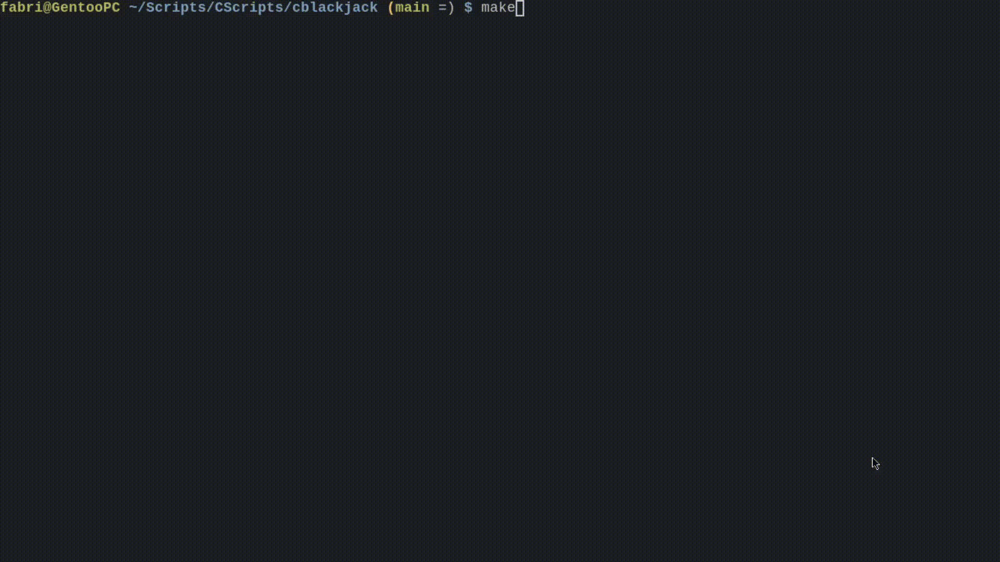
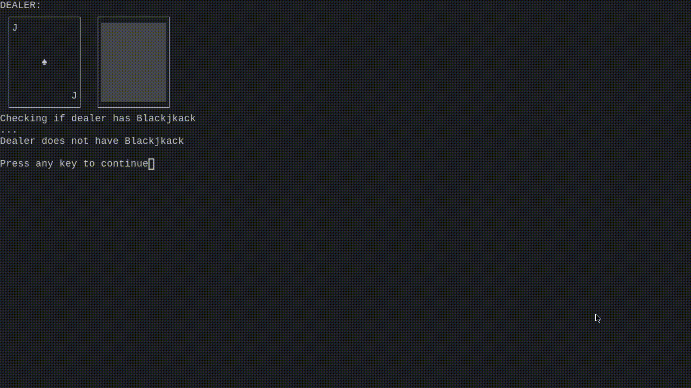

# Blackjack Basic Strategy

## What the program does

Play Blackjack with your friends (locally) right on the terminal!

Each time a move is made, the program will let you know if the decision you made is the correct one, according to the Blackjack Basic Strategy chart.

### Demonstration
Basic round:


Just like in real life, you can split your cards:


## Blackjack rules
- You can hit and stand as long as you haven't bust
- You can double down only in your first hand
- You can split your cards (4 splits max [This is fairly standard])
- Dealer stops at soft 17
- You can ask for insurance if the dealer has an ace (No insurance is offered with a 10)
    - Insurance is worth half your bet
- If the dealer has Blackjack, play is suspended (If a player did ask for insurance, they'll be rewarded)
- There's no surrender (Although it could be implemented)

## How to install
Just clone the repository and run:
```sh
make
```

## Charts
### Hard Hands
|    |  2 | 3  | 4  | 5  | 6  | 7  | 8  | 9  | 10 | A  |
|----|----|----|----|----|----|----|----|----|----|----|
| 5  | Hit | Hit | Hit | Hit | Hit | Hit | Hit | Hit | Hit | Hit |
| 6  | Hit | Hit | Hit | Hit | Hit | Hit | Hit | Hit | Hit | Hit |
| 7  | Hit | Hit | Hit | Hit | Hit | Hit | Hit | Hit | Hit | Hit |
| 8  | Hit | Hit | Hit | Hit | Hit | Hit | Hit | Hit | Hit | Hit |
| 9  | Hit | Double Down | Double Down | Double Down | Double Down | Hit | Hit | Hit | Hit | Hit |
|10  | Double Down | Double Down | Double Down | Double Down | Double Down | Double Down | Double Down | Double Down | Hit | Hit |
|11  | Double Down | Double Down | Double Down | Double Down | Double Down | Double Down | Double Down | Double Down | Double Down | Double Down |
|12  | Hit | Hit | Stand | Stand | Stand | Hit | Hit | Hit | Hit | Hit |
|13  | Stand | Stand | Stand | Stand | Stand | Hit | Hit | Hit | Hit | Hit |
|14  | Stand | Stand | Stand | Stand | Stand | Hit | Hit | Hit | Hit | Hit |
|15  | Stand | Stand | Stand | Stand | Stand | Hit | Hit | Hit | Hit | Hit |
|16  | Stand | Stand | Stand | Stand | Stand | Hit | Hit | Hit | Hit | Hit |
|17  | Stand | Stand | Stand | Stand | Stand | Stand | Stand | Stand | Stand | Stand |
|18  | Stand | Stand | Stand | Stand | Stand | Stand | Stand | Stand | Stand | Stand |
|19  | Stand | Stand | Stand | Stand | Stand | Stand | Stand | Stand | Stand | Stand |
|20  | Stand | Stand | Stand | Stand | Stand | Stand | Stand | Stand | Stand | Stand |
|21  | Stand | Stand | Stand | Stand | Stand | Stand | Stand | Stand | Stand | Stand |

### Soft Hands
|   |  2 |  3 |  4 |  5 |  6 |  7 |  8 |  9 | 10 | A  |
|---|----|----|----|----|----|----|----|----|----|----|
|A,2| Hit | Hit | Hit | Double Down | Double Down | Hit | Hit | Hit | Hit | Hit |
|A,3| Hit | Hit | Hit | Double Down | Double Down | Hit | Hit | Hit | Hit | Hit |
|A,4| Hit | Hit | Double Down | Double Down | Double Down | Hit | Hit | Hit | Hit | Hit |
|A,5| Hit | Hit | Double Down | Double Down | Double Down | Hit | Hit | Hit | Hit | Hit |
|A,6| Hit | Double Down | Double Down | Double Down | Double Down | Hit | Hit | Hit | Hit | Hit |
|A,7| Stand | Double Down | Double Down | Double Down | Double Down | Stand | Stand | Hit | Hit | Hit |
|A,8| Stand | Stand | Stand | Stand | Stand | Stand | Stand | Stand | Stand | Stand |
|A,9| Stand | Stand | Stand | Stand | Stand | Stand | Stand | Stand | Stand | Stand |

### Split hands
|     | 2  |3   |4   |5   |6   |7   |8   |9   |10  |A  |
|-----|----|----|----|----|----|----|----|----|----|---|
| 2,2 | Split | Split | Split | Split | Split | Split | Hit | Hit | Hit | Hit|
| 3,3 | Split | Split | Split | Split | Split | Split | Hit | Hit | Hit | Hit|
| 4,4 | Hit | Hit | Hit | Split | Split | Hit | Hit | Hit | Hit | Hit|
| 5,5 | Double Down | Double Down | Double Down | Double Down | Double Down | Double Down | Double Down | Double Down | Hit | Hit|
| 6,6 | Split | Split | Split | Split | Split | Hit | Hit | Hit | Hit | Hit|
| 7,7 | Split | Split | Split | Split | Split | Split | Hit | Hit | Hit | Hit|
| 8,8 | Split | Split | Split | Split | Split | Split | Split | Split | Split | Split|
| 9,9 | Split | Split | Split | Split | Split | Stand | Split | Split | Split | Split|
| T,T | Stand | Stand | Stand | Stand | Stand | Stand | Stand | Stand | Stand | Stand|
| A,A | Split | Split | Split | Split | Split | Split | Split | Split | Split | Split|


## TODO:
- [ ] Make it so that the program takes into account the running/true count, in order to practice [Card Counting](https://en.wikipedia.org/wiki/Card_counting)
    - This shouldn't be too hard to do

## Asterisks:
1: This is the first time I write anything in C. The code isn't the cleanest. I'll probably refactor stuff later on.
There are messy things in the source code. I just wanted to finish it

2. Enjoy ^_^
